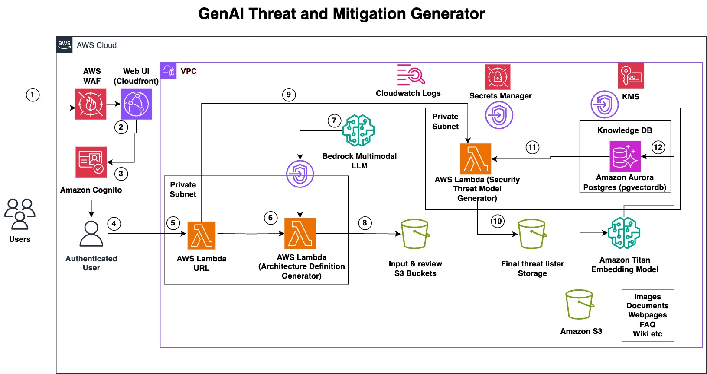

# Threat mitigation AI tool

## Limitations about tool
- This application will be deployed as a single-tenant solution and requires manual user creation in Amazon Cognito. Self-service registration through the application's user interface has been disabled due to security considerations.
- By default, no retention period or lifecycle policies are configured for the S3 buckets. Users can implement their own lifecycle policies to manage data retention and optimize storage costs according to their requirements.
- The application's user interface supports architecture diagrams up to 5MB in size, accepting PNG format.

## Architecture

  

    
  

## Context keys
Set following context keys in the `cdk.json` file
- Database name:
  - context key `database-name` (optional) 
- Cognito UI:
  - Domain: context key `webapp-cognito-domain` OR `webapp-cognito-domain-prefix`
  - Certificate: context key `webapp-cognito-certificate-arn` if `webapp-cognito-domain` was set
- Webapp: 
  - `webapp-domain` and `webapp-certificate-arn`
  - if not set, default cloudfront domain will be used
  - If CDK deployment is generating some issues then please try to use localbuild as well:
    - `cdk deploy ThreatMitigationStack -c webapp-enforce-local-bundling=true`

## Deployment guide
- Create virtual env with `python3 -m venv .venv`
- Activate virtual env with `source .venv/bin/activate`
- Install python dependencies with `pip install -r requirements.txt`
- Install docker-compatible engine, `finch` is recommended, you can use `CDK_DOCKER=finch` environment variable to configure.
- Install finch in your local machine and execute command "finch vm init" to initialize environment.
    - If there is any issue with finch then please make use of docker:  you can use `CDK_DOCKER=docker` environment variable to configure. By default, it uses docker only.
- enable AWS Bedrock `anthropic.claude-3-sonnet-20240229-v1:0` and `amazon.titan-embed-text-v2:0` in deployment region
- export AWS_REGION variable. 
- Bootstrap your environment for use with CDK by following URL: https://docs.aws.amazon.com/cdk/v2/guide/bootstrapping-env.html
- Please make sure to use node version 22 before proceeding with deployment. Uninstall node 23 version from local machine and set path for version 22.
- Deploy stack with `cdk deploy --all`
- export webapp environment with command `aws cloudformation describe-stacks --stack-name ThreatMitigationStack  | jq '.Stacks[0].Outputs[] | select(.OutputKey == "WebAppEnvironment") | .OutputValue | fromjson | to_entries[] | [.key,.value] | join("=")' --raw-output > webapp/.env`
- Deploy ThreatMitigationStack again with `cdk deploy ThreatMitigationStack`
- Place pdf documents in bucket (check output `ThreatMitigationStack.VectorStoreDocumentsBucket`)
  - These documents will be used as knowledge base so please add require documents as per your requirement and expected output can also be changed by modifying lambda prompts.
- Try in browser using output `ThreatMitigationStack.WebAppUrl`

## Structure

- `infrastructure` - CDK root
  - `network_stack.py` - VPC with private subnets and required VPC interface endpoints
  - `global_stack.py` - WAF and resources that needs to be located in us-east-1
  - `api` - endpoint definition
    - `api_endpoint.py` - base constructs for lambda endpoint
    - `diagram_to_text.py` - converts base64 encoded image to description
    - `summary_to_threat_model.py` - generates threat model based on given diagram description
    - 
  - `vectorstore` - create DB, document loader and configurator to manage DB users and connections
    - _`configurator_custom_resource_lambda` - lambda function to create initial DB schema and manage users
    - _`document_loader_lambda` - lambda function to load files from S3 bucket
    - _`layer` - lambda layer that contains code required to DB using IAM authorizer, can be used outside of vectorstore
  - `webapp` - webapp deployment stuff
